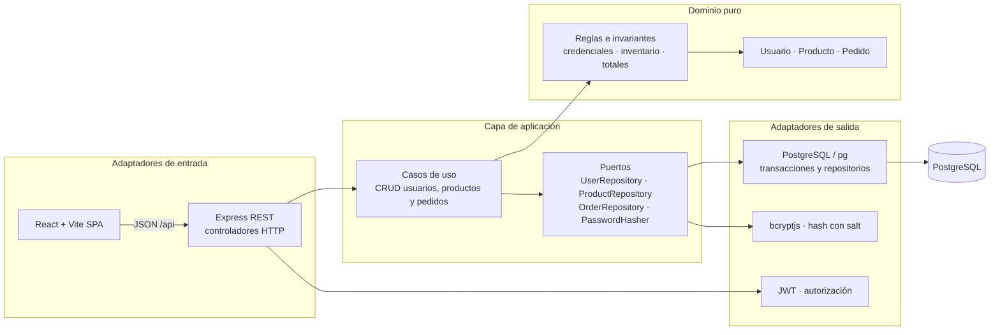

# Arquitectura de Cancha Once

## Diagrama



El dominio no depende de Express, React ni PostgreSQL. `application/ports.js` declara los contratos de salida, `application/use-cases.js` ejecuta los casos de uso y `infrastructure/` implementa los adaptadores. Los controladores HTTP traducen la entrada y salida JSON. En React, `client/src/services/api.js` concentra el acceso HTTP.

**Entidades y relaciones**

- `users`: un cliente puede tener varios pedidos; guarda `password_hash`, nunca la contraseña.
- `products`: catálogo con precio positivo e inventario entero no negativo.
- `orders`: pertenece a un usuario y conserva su total y estado.
- `order_items`: tabla de unión de pedido y productos con cantidad y precio unitario al comprar.

El alta de pedido bloquea cada fila de inventario (`FOR UPDATE`), verifica existencias, captura precio y descuenta existencias en una misma transacción. La cancelación repone el stock y conserva el historial del pedido.

## Endpoints

Todos los cuerpos y respuestas usan JSON. Las rutas protegidas reciben `Authorization: Bearer <token>`. El registro público asigna siempre rol `customer`; solo un administrador puede cambiar roles.

| Método | Ruta | Acceso | Operación |
|---|---|---|---|
| POST | `/api/auth/register` | Público | Registrar cliente y obtener JWT |
| POST | `/api/auth/login` | Público | Iniciar sesión |
| GET | `/api/users` | Administrador | Listar usuarios sin hashes |
| POST | `/api/users` | Administrador | Crear cuenta |
| GET | `/api/users/:id` | Administrador | Consultar usuario |
| PUT | `/api/users/:id` | Administrador | Editar nombre/correo/rol |
| DELETE | `/api/users/:id` | Administrador | Eliminar si no tiene pedidos |
| GET | `/api/products` | Público | Listar catálogo |
| POST | `/api/products` | Administrador | Crear producto |
| GET | `/api/products/:id` | Público | Consultar producto |
| PUT | `/api/products/:id` | Administrador | Editar producto e inventario |
| DELETE | `/api/products/:id` | Administrador | Eliminar si no hay pedidos asociados |
| POST | `/api/orders` | Cliente autenticado | Crear pedido: `{ "items": [{"productId":1,"quantity":2}] }` |
| GET | `/api/orders` | Autenticado | Listar los propios; administrador lista todos |
| GET | `/api/orders/:id` | Propietario o administrador | Consultar un pedido |
| PUT | `/api/orders/:id` | Propietario/administrador | Cancelar pendiente; administrador gestiona estados |
| DELETE | `/api/orders/:id` | Propietario (pendiente) / administrador | Eliminar; restituir stock si estaba pendiente |

## Seguridad y primer administrador

Contraseñas con bcrypt, costo 12; requisitos: 10 caracteres, mayúscula, minúscula y número. JWT vence en dos horas. Helmet, límite de intentos de login/registro, consultas parametrizadas, validación de datos, CORS restringido y control de roles/propiedad completan la API. Mantén `.env` fuera de Git. Para habilitar el panel de administración en esta instancia de práctica, primero registra una cuenta cliente en la web y luego cambia su rol por SQL desde WSL:

```bash
cd ~/futbol-store
sudo -u postgres psql futbol_store -c "UPDATE users SET role='admin' WHERE email='tu-correo@ejemplo.com';"
```

El cambio SQL es un paso de inicialización local porque todavía no existe una cuenta administradora. Cierra sesión e inicia sesión otra vez para obtener el rol nuevo en el token.
