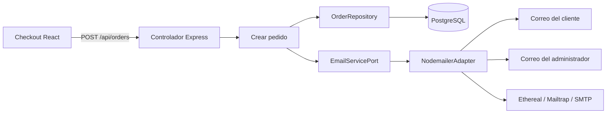

# Notificaciones de pedidos por correo

## Arquitectura hexagonal

El caso de uso solo conoce `EmailServicePort`, declarado en `server/src/application/ports.js`. `NodemailerAdapter` y las plantillas viven en infraestructura. Sin credenciales SMTP, el pedido igual se guarda como `pending` (pendiente de pago) y la interfaz indica que el correo no se envió.

## Prueba con Ethereal

1. Ejecuta `npm run email:ethereal -w server` desde la raíz del proyecto.
2. Copia `SMTP_HOST`, `SMTP_PORT`, `SMTP_USER` y `SMTP_PASS` en `server/.env`. Configura `ADMIN_EMAIL`, `EMAIL_FROM` y `PAYMENT_INSTRUCTIONS`.
3. Reinicia la API, crea un pedido desde checkout y abre la bandeja Ethereal impresa por el comando.
4. Revisa el correo al cliente (detalle, total e instrucciones) y la notificación al administrador.

Ethereal captura mensajes y no los entrega a una dirección real. Esta configuración no incluye capturas recibidas porque el proyecto no contiene credenciales SMTP de prueba.
